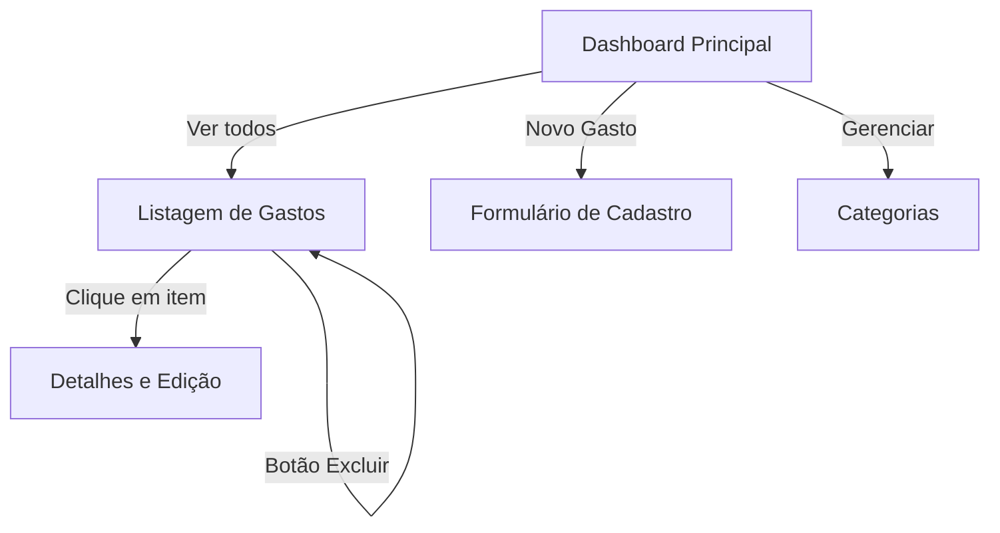

# 📱 Wireframes da Interface e Mapeamento com a API REST

Este documento apresenta o planejamento visual e a arquitetura de telas do **FinContas**, demonstrando como cada componente da interface gráfica consome os endpoints da API REST desenvolvida em Node.js.

---

## 🗺️ Mapa de Navegação da Aplicação



---

## 1. Tela: Dashboard Financeiro (Página Inicial)

### 📐 Layout do Wireframe
```
+-----------------------------------------------------------------------------------+
|  💰 FinContas              [ Dashboard ]  [ Gastos ]  [ Categorias ]    (👤 Usuário) |
+-----------------------------------------------------------------------------------+
|  FILTRO DO PERÍODO: [ Mês: Agosto ▼ ] [ Ano: 2026 ▼ ]              [ + Novo Gasto ]|
+-----------------------------------------------------------------------------------+
|                                                                                   |
|  +-----------------------+  +-----------------------+  +-----------------------+  |
|  |  TOTAL GASTO NO MÊS   |  |  QUANTIDADE DE GASTOS |  |  CATEGORIA TOP GASTO  |  |
|  |     R$ 686,65         |  |         3 despesas    |  |     Alimentação       |  |
|  +-----------------------+  +-----------------------+  +-----------------------+  |
|                                                                                   |
|  +-------------------------------------+  +------------------------------------+  |
|  | 📊 DISTRIBUIÇÃO POR CATEGORIA       |  | 🏆 MAIORES GASTOS DO MÊS           |  |
|  |                                     |  |                                    |  |
|  | - Alimentação: R$ 450,75  (65%)     |  | 1. Compras Supermercado - R$ 450,75|  |
|  | - Transporte:  R$ 180,00  (26%)     |  | 2. Combustível Shell    - R$ 180,00|  |
|  | - Lazer:       R$  55,90  ( 9%)     |  | 3. Streaming            - R$  55,90|  |
|  +-------------------------------------+  +------------------------------------+  |
+-----------------------------------------------------------------------------------+
```

### 🔗 Mapeamento com a API
| Componente da Tela | Evento / Ação | Método | Endpoint da API |
| :--- | :--- | :---: | :--- |
| **Carregamento da Tela / Filtro** | Ao carregar ou alterar mês/ano | `GET` | `/api/v1/dashboard/resumo?mes=MM&ano=YYYY` |
| **Cards de Resumo & Gráfico** | Preenchimento automático | `GET` | `/api/v1/dashboard/resumo` |
| **Botão "+ Novo Gasto"** | Clique | - | Redireciona para o formulário de cadastro |

---

## 2. Tela: Listagem de Gastos com Filtros

### 📐 Layout do Wireframe
```
+-----------------------------------------------------------------------------------+
|  💰 FinContas              [ Dashboard ]  [ Gastos* ]  [ Categorias ]   (👤 Usuário) |
+-----------------------------------------------------------------------------------+
|  FILTROS DE BUSCA:                                                                |
|  [ Mês: 08 ▼ ]  [ Ano: 2026 ▼ ]  [ Categoria: Todas ▼ ]  [ Filtrar ]   [ + Novo ] |
+-----------------------------------------------------------------------------------+
|                                                                                   |
|  LISTA DE GASTOS                                                                  |
|  +-----------------------------------------------------------------------------+  |
|  | DATA       | DESCRIÇÃO               | CATEGORIA    | VALOR    | AÇÕES      |  |
|  +------------+-------------------------+--------------+----------+------------+  |
|  | 10/08/2026 | Compras Supermercado    | Alimentação  | R$ 450,75| [✏️]  [🗑️]   |  |
|  | 15/08/2026 | Combustível Shell       | Transporte   | R$ 180,00| [✏️]  [🗑️]   |  |
|  | 20/08/2026 | Assinatura Streaming    | Lazer        | R$  55,90| [✏️]  [🗑️]   |  |
|  +-----------------------------------------------------------------------------+  |
|  Total exibido: R$ 686,65 (3 registros)                                           |
+-----------------------------------------------------------------------------------+
```

### 🔗 Mapeamento com a API
| Componente da Tela | Evento / Ação | Método | Endpoint da API |
| :--- | :--- | :---: | :--- |
| **Tabela de Gastos** | Ao carregar a página | `GET` | `/api/v1/gastos` |
| **Filtro por Parâmetros** | Clique no botão "Filtrar" | `GET` | `/api/v1/gastos?mes=MM&ano=YYYY&categoria=NOME` |
| **Botão Excluir [🗑️]** | Clique e confirmação no modal | `DELETE` | `/api/v1/gastos/:id` |
| **Botão Editar [✏️]** | Clique | `GET` | `/api/v1/gastos/:id` *(abre modal/tela de edição)* |

---

## 3. Tela: Cadastro de Novo Gasto

### 📐 Layout do Wireframe
```
+-----------------------------------------------------------------------------------+
|  💰 FinContas              [ Dashboard ]  [ Gastos ]  [ Categorias ]    (👤 Usuário) |
+-----------------------------------------------------------------------------------+
|                                                                                   |
|                          +-------------------------------+                        |
|                          |       📝 NOVO GASTO           |                        |
|                          +-------------------------------+                        |
|                          | Descrição:                    |                        |
|                          | [ Ex: Jantar Restaurante    ] |                        |
|                          |                               |                        |
|                          | Valor (R$):                   |                        |
|                          | [ 145,50                    ] |                        |
|                          |                               |                        |
|                          | Data do Gasto:                |                        |
|                          | [ 2026-08-26                ] |                        |
|                          |                               |                        |
|                          | Categoria:                    |                        |
|                          | [ Alimentação             ▼ ] |                        |
|                          |                               |                        |
|                          | Forma de Pagamento:           |                        |
|                          | [ Cartão de Crédito       ▼ ] |                        |
|                          |                               |                        |
|                          | [  Salvar Gasto  ] [Cancelar] |                        |
|                          +-------------------------------+                        |
|                                                                                   |
+-----------------------------------------------------------------------------------+
```

### 🔗 Mapeamento com a API
| Componente da Tela | Evento / Ação | Método | Endpoint da API |
| :--- | :--- | :---: | :--- |
| **Select de Categorias** | Ao abrir o formulário | `GET` | `/api/v1/categorias` |
| **Botão "Salvar Gasto"** | Envio do formulário | `POST` | `/api/v1/gastos` *(com JSON no body)* |

---

## 4. Tela: Edição e Detalhes do Gasto

### 📐 Layout do Wireframe
```
+-----------------------------------------------------------------------------------+
|  💰 FinContas              [ Dashboard ]  [ Gastos ]  [ Categorias ]    (👤 Usuário) |
+-----------------------------------------------------------------------------------+
|                                                                                   |
|                          +-------------------------------+                        |
|                          |     ✏️ EDITAR DESPESA         |                        |
|                          | ID: d1a8c456-7890-4abc...     |                        |
|                          +-------------------------------+                        |
|                          | Descrição:                    |                        |
|                          | [ Compras Supermercado      ] |                        |
|                          |                               |                        |
|                          | Valor (R$):                   |                        |
|                          | [ 450,75                    ] |                        |
|                          |                               |                        |
|                          | Data:                         |                        |
|                          | [ 2026-08-10                ] |                        |
|                          |                               |                        |
|                          | Categoria:                    |                        |
|                          | [ Alimentação             ▼ ] |                        |
|                          |                               |                        |
|                          | Forma de Pagamento:           |                        |
|                          | [ Cartão de Crédito       ▼ ] |                        |
|                          |                               |                        |
|                          | [ Atualizar ] [ Excluir ]     |                        |
|                          +-------------------------------+                        |
|                                                                                   |
+-----------------------------------------------------------------------------------+
```

### 🔗 Mapeamento com a API
| Componente da Tela | Evento / Ação | Método | Endpoint da API |
| :--- | :--- | :---: | :--- |
| **Carregamento inicial** | Ao abrir a tela de edição | `GET` | `/api/v1/gastos/:id` |
| **Botão "Atualizar"** | Envio dos campos modificados | `PUT` | `/api/v1/gastos/:id` *(com JSON no body)* |
| **Botão "Excluir"** | Confirmação de remoção | `DELETE` | `/api/v1/gastos/:id` |

---

## 5. Tela: Gestão de Categorias

### 📐 Layout do Wireframe
```
+-----------------------------------------------------------------------------------+
|  💰 FinContas              [ Dashboard ]  [ Gastos ]  [ Categorias* ]   (👤 Usuário) |
+-----------------------------------------------------------------------------------+
|  CATEGORIAS DISPONÍVEIS                                                           |
|                                                                                   |
|  +-------------------+  +-------------------+  +-------------------+              |
|  | 🍔 Alimentação    |  | 🚗 Transporte     |  | 🏠 Moradia        |              |
|  +-------------------+  +-------------------+  +-------------------+              |
|  | 🎮 Lazer          |  | 🏥 Saúde          |  | 📚 Educação       |              |
|  +-------------------+  +-------------------+  +-------------------+              |
|  | 📦 Outros         |                                                            |
|  +-------------------+                                                            |
+-----------------------------------------------------------------------------------+
```

### 🔗 Mapeamento com a API
| Componente da Tela | Evento / Ação | Método | Endpoint da API |
| :--- | :--- | :---: | :--- |
| **Grid de Categorias** | Ao abrir a tela | `GET` | `/api/v1/categorias` |
